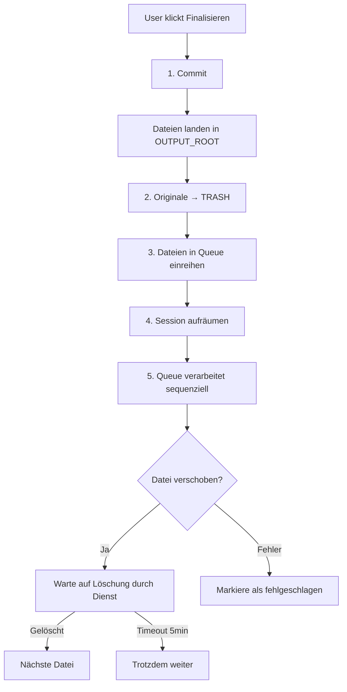

# Datei-Lebenszyklus im OCR-Service

## Übersicht: Wo landen die Dateien?

### 1. **Original-Dateien** (INPUT_ROOT)
**Pfad:** `/app/medidok/` (Netzlaufwerk M:)

**Status:**
- ✅ Werden beim Finalisieren **sofort in TRASH** verschoben
- ✅ Bleiben im TRASH als Backup erhalten

**Beispiel:**
```
VORHER: /app/medidok/scan_2025.pdf
NACHHER: /app/medidok/trash/session_abc123_20250124_143022/scan_2025.pdf
```

### 2. **Verarbeitete Dateien** (OUTPUT_ROOT)
**Pfad:** `/app/medidok/import/`

**Status:**
- ✅ Werden nach Commit hier abgelegt
- ✅ Werden durch Queue in IMPORT_MEDIDOK verschoben
- ✅ Danach aus OUTPUT_ROOT gelöscht (durch `os.rename`)

**Beispiel:**
```
VORHER: /app/medidok/import/Mueller_Hans_19800101_20250124_Befund.pdf
Queue verschiebt nach: /app/medidok/import/Mueller_Hans_19800101_20250124_Befund.pdf
NACHHER: Datei nicht mehr in OUTPUT_ROOT (wurde verschoben, nicht kopiert)
```

### 3. **Import-Verzeichnis** (IMPORT_MEDIDOK)
**Pfad:** `/app/medidok/import/` (gleiches Verzeichnis wie OUTPUT_ROOT!)

**Status:**
- ✅ Hier liegen Dateien für externen Dienst
- ✅ Externer Dienst liest und **löscht** die Dateien
- ✅ Queue wartet auf Löschung, dann nächste Datei

**Beispiel:**
```
Datei liegt hier: /app/medidok/import/Mueller_Hans_19800101_20250124_Befund.pdf
Externer Dienst: liest Datei → importiert in Datenbank → löscht Datei
Queue-Service: Sieht Löschung → verschiebt nächste Datei
```

## Wichtig: OUTPUT_ROOT = IMPORT_MEDIDOK

**ACHTUNG:** In Ihrer Config sind beide Pfade identisch:
```python
OUTPUT_ROOT = "/app/medidok/import"
IMPORT_MEDIDOK = "/app/medidok/import"
```

Das bedeutet:
- Dateien werden nicht kopiert, sondern sind **bereits am richtigen Ort**
- Die Queue verschiebt sie **innerhalb desselben Verzeichnisses**
- Das ist eigentlich **ineffizient** - Dateien liegen schon dort!

## Ablauf beim Finalisieren



## Was passiert beim "Abbrechen"?

### Vor Finalisierung (im Control-Panel):
```javascript
// Button: "⬅ Abbrechen und zur Startseite"
abortAll() → /abort →
  - Staging wird verworfen
  - Original-Dateien bleiben unberührt
  - Zurück zur Startseite
```

### Nach Finalisierung (im Queue-Monitor):
```javascript
// Button: "✅ Monitoring beenden und zur Startseite"
closeQueueMonitor() →
  - Monitor stoppt
  - Queue läuft WEITER im Hintergrund!
  - Originale sind bereits im TRASH
  - Import wird fortgesetzt
  - Zurück zur Startseite
```

**→ Das ist KORREKT!** Der Import läuft weiter, auch wenn User zur Startseite geht.

## Problem: "Datei wird nicht gelöscht"

### Mögliche Szenarien:

#### Szenario 1: Original-Datei bleibt in INPUT_ROOT
**Symptom:** Datei ist noch in `/app/medidok/`

**Ursache:**
- Datei war nicht in `originalFilename` gespeichert
- Fehler beim Verschieben nach TRASH

**Lösung:** Prüfen Sie die Logs:
```bash
grep "Original in TRASH" /app/medidok/logs/ocr-app.log
grep "Original nicht gefunden" /app/medidok/logs/ocr-app.log
```

#### Szenario 2: Datei bleibt in IMPORT_MEDIDOK
**Symptom:** Datei liegt noch in `/app/medidok/import/`

**Ursache:**
- Externer Dienst hat die Datei **nicht gelöscht**
- Queue wartet max. 5 Minuten, dann Timeout

**Lösung:**
1. Prüfen ob externer Dienst läuft
2. Prüfen ob Dienst Schreibrechte hat
3. Prüfen die Logs:
```bash
grep "Warte auf Löschung" /app/medidok/logs/ocr-app.log
grep "Timeout beim Warten" /app/medidok/logs/ocr-app.log
```

#### Szenario 3: Datei bleibt in OUTPUT_ROOT
**Symptom:** Datei liegt noch in `/app/medidok/import/` aber wurde nicht verarbeitet

**Ursache:**
- OUTPUT_ROOT = IMPORT_MEDIDOK (gleiches Verzeichnis!)
- Queue konnte Datei nicht verschieben
- `os.rename(src, dst)` schlägt fehl wenn Quelle = Ziel

**Lösung:**
Anpassen der Queue-Logik für identische Verzeichnisse!

## Empfohlene Verbesserung

### Problem identifiziert:

Da `OUTPUT_ROOT = IMPORT_MEDIDOK`, macht `os.rename(src, dst)` keinen Sinn!

**Aktuell in [services/import_queue.py](services/import_queue.py:177):**
```python
_os_real.rename(task.source_path, str(destination))
```

Wenn `source_path` und `destination` gleich sind, macht das nichts!

### Lösung A: Verschiedene Verzeichnisse verwenden

```python
# In config.py ändern:
OUTPUT_ROOT = "/app/medidok/staging"  # NEU: Separates Verzeichnis
IMPORT_MEDIDOK = "/app/medidok/import"
```

### Lösung B: Skip wenn bereits am richtigen Ort

```python
# In import_queue.py hinzufügen:
if str(Path(task.source_path).resolve()) == str(destination.resolve()):
    log(f"✅ Datei ist bereits in IMPORT: {task.filename}")
    # Keine Verschiebung nötig, direkt auf Löschung warten
else:
    _os_real.rename(task.source_path, str(destination))
```

## Was Sie jetzt tun sollten

### 1. Prüfen Sie Ihre Config:
```bash
cat /app/config.py | grep -E "OUTPUT_ROOT|IMPORT_MEDIDOK"
```

### 2. Prüfen Sie ob Dateien wirklich verschoben werden:
```bash
# Vor Finalisierung:
ls -la /app/medidok/import/

# Nach Finalisierung (sofort):
ls -la /app/medidok/import/

# Sollten die gleichen Dateien sein!
```

### 3. Prüfen Sie TRASH:
```bash
ls -la /app/medidok/trash/
# Sollte Session-Ordner mit Originalen enthalten
```

### 4. Prüfen Sie Logs:
```bash
tail -f /app/medidok/logs/ocr-app.log
```

## Zusammenfassung

| Datei-Typ | Von | Nach | Wann gelöscht? |
|-----------|-----|------|----------------|
| **Original** | INPUT_ROOT | TRASH | Beim Finalisieren (sofort) |
| **Verarbeitet** | OUTPUT_ROOT | IMPORT_MEDIDOK | Durch Queue-Verschiebung |
| **Import** | IMPORT_MEDIDOK | - | Durch externen Dienst |

**Wichtig:**
- ✅ Originale sind **sicher im TRASH**
- ✅ Queue läuft auch nach "Abbrechen" weiter
- ⚠️ Wenn OUTPUT_ROOT = IMPORT_MEDIDOK, ist Queue redundant!

## Nächste Schritte

Bitte prüfen Sie:
1. Wo genau liegt die "nicht gelöschte" Datei?
2. Sind OUTPUT_ROOT und IMPORT_MEDIDOK identisch?
3. Was sagen die Logs?

Dann kann ich das konkrete Problem beheben!
